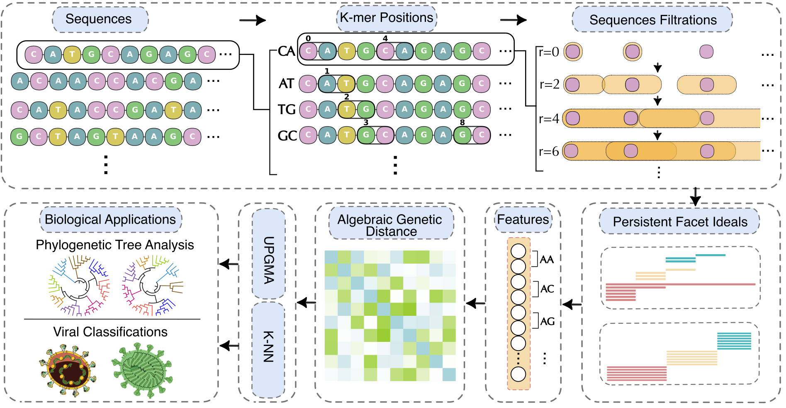

# CAKL: Commutative Algebra K-mer Learning



CAKL is an alignment-free method that computes k-mer algebraic representations of sequences based on k-mer analysis leveraging tools from commutative algebra, as detailed in the main manuscript. Though the code is designed for DNA sequences, the method can be generalized to arbitrary finite sequences.

Copyright © 2025 Faisal Suwayyid.

## Table of Contents

- [CAKL](#CAKL)
  - [Table of Contents](#table-of-contents)
  - [Description](#description)
  - [Basic Usage](basic-usage)
  - [Instructions for Usage](instructions-for-usage)
  - [License](#license)
  - [Citation](#citation)
  - [Required Packages](#required-packages)
  - [Respository File description](#respository-file-description)

## Description

CAKL is an alignment-free method that computes k-mer algebraic representations of sequences based on k-mer analysis leveraging tools from commutative algebra, as detailed in the main manuscript. Though the code is designed for DNA sequences, the method can be generalized to arbitrary finite sequences.

## Basic Usage

- **`example.py`**  
  Provides a minimal example for generating features.  
  Simply replace the placeholder sequence with your own sequence and run the script.  
  The code will generate the features for the provided sequence and save them in a file.
  The generated features include the f-, h-, and facet curves.
  You can also modify it as needed to suit your workflow.  

- **`example.ipynb`**  
  A complete example pipeline:  
  - Reads sequences from a FASTA file and their labels from a CSV file.  
  - Generates features for each sequence (saved as individual NumPy arrays).  
  - Stacks the features into a single feature matrix.  
  - Computes the distance matrix from the generated features.
  - Construct the tree, view it, and save a Newick version of the tree.
  - Demo runtime: less than 10 minutes.

## Instructions for Usage
To use the code on your data, please ensure your input files are properly formatted:

1. **FASTA file**
   - Contains DNA sequences.
   - Each sequence should include its accession or accession with version.
   - If you are working with non-DNA data, you may need to modify the nucleotide bases in the code (psrt.py).

2. **CSV file**
    - Must contain a column named `Accession (version)` that exactly matches the accessions (or accessions with versions) in the FASTA file.  
    - Must also include a label column named `Name`.  
    - If your CSV uses different column names, update the code accordingly (see `example.ipynb`), or copy the code from `example.ipynb` and prepare a new script that uses your CSV columns.  


## License

CAKL is licensed under the MIT license (COPYING.txt), with an extra clause (CONTRIBUTING.txt) clarifying the license for modifications released without an explicit written license agreement.

## Citation

If you wish to cite this work, please use the following citation:
```
@misc{suwayyid2025caklcommutativealgebrakmerlearning,
      title={CAKL: Commutative Algebra $k$-mer Learning of Genomics}, 
      author={Faisal Suwayyid and Yuta Hozumi and Hongsong Feng and Mushal Zia and JunJie Wee and Guo-Wei Wei},
      year={2025},
      eprint={2508.09406},
      archivePrefix={arXiv},
      primaryClass={q-bio.GN},
      url={https://arxiv.org/abs/2508.09406}, 
}
```

## Required Packages
The codes have been tested on macOS: Sonoma (14.6.1). The individual packages that we utilized are listed below:
```
numpy==1.26.4
scikit-learn
scipy==1.13.1
gudhi==3.10.1
biopython==1.84
matplotlib==3.10.0
pandas==2.2.2
seaborn==0.13.2
```

## Repository File Description

- **`CAKL/`**  
  Contains the core source code and examples:  
  - `psrt.py`: main implementation of the CAKL framework.  
  - `example.py`: usage example on arbitrary sequences.  
  - `example.ipynb`: Jupyter notebook demonstrating how to reproduce feature extraction and distance computations for two sample datasets.  

- **`CAKL/data2/`**  
  Includes two example datasets used in the experiments and demonstrations.  

